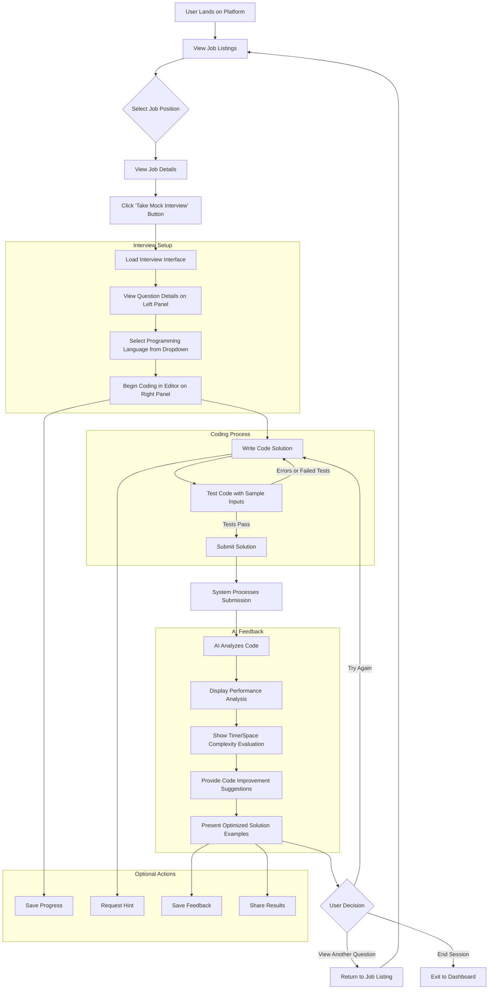

# AI Mock Interview Simulator

A professional coding interview platform that allows users to practice job-specific technical interviews with AI-powered code review and feedback. Built with modern web technologies, this platform provides a seamless experience for developers to enhance their technical interview skills and land their dream jobs.

## Overview

The AI Mock Interview Simulator is designed to help job seekers prepare for technical interviews by simulating real-world coding challenges. Users can browse job listings, select a position, and engage in a mock interview with a LeetCode-style coding interface. After submitting their solutions, users receive detailed AI-powered feedback, including performance analysis, improvement suggestions, and optimized solution examples.

## Features

### **Job Listings View**  
A clean grid layout of job positions fetched from an API (`http://localhost:5000/api/jobs`). Each job is displayed as a card with details like title, company, location, and description, along with a prominent "Take Mock Interview" button to start the interview process.

### **Split-Screen Coding Interface**  
A LeetCode-style layout with:
- **Left Panel**: Displays question details, including the problem statement, constraints, and sample test cases.
- **Right Panel**: A full-featured code editor where users can write and test their solutions.

### **Language Selection**  
A dropdown menu allowing users to choose from popular programming languages such as Python, JavaScript, Java, and more, ensuring flexibility in solving coding challenges.

### **AI Feedback Panel**  
After submitting a solution, a detailed feedback section appears, including:
- Performance analysis (e.g., time and space complexity).
- Improvement suggestions to optimize the code.
- Optimized solution examples to help users learn best practices.

## **User Flow**



## **Implementation Details**

### **Job Listings View (Practice Page)**
The `/practice` route serves as the main entry point for users to browse job listings. Key details include:

- **API Integration**: Fetches job data from `http://localhost:5000/api/jobs` using the Fetch API.
- **State Management**: Uses React’s `useState` and `useEffect` hooks to manage job data, loading state, and error state.
- **Error Handling**:
  - "Loading jobs..." while fetching data.
  - "Error: [message] Retry" if the API request fails.
  - "No jobs available" if the API returns an empty array.
- **Grid Layout**: Responsive grid (`sm:grid-cols-2 lg:grid-cols-3`) using the `JobCard` component.
- **Navigation**: Clicking "Take Mock Interview" navigates to `/interview?jobId=${jobId}` using React Router’s `useNavigate` hook.

### **Job Card (JobCard Component)**
Each job listing is rendered as a card with:

- **Design**: A clean, modern layout using ShadCN UI’s `Card` component with Tailwind CSS.
- **Details Displayed**:
  - Job title, company, location, job type, posted date, truncated description.
  - A company logo (fallback image if unavailable).
- **Icons**: Uses Lucide React icons (`Building2`, `MapPin`, `BriefcaseBusiness`, `Calendar`).
- **Interactive Button**: "Take Mock Interview" button navigates to the interview page.
- **Responsive Styling**: Hover effects and transitions.

### **Split-Screen Coding Interface**
The `/interview?jobId=${jobId}` page features:

- **Left Panel**: Displays the coding question.
- **Right Panel**: A code editor supporting syntax highlighting and auto-formatting.

### **Language Selection**
A dropdown menu allows users to select a preferred programming language before starting the challenge.

### **AI Feedback Panel**
After submitting a solution, the feedback panel provides:

- **Performance Analysis**: Evaluates correctness, efficiency, and best practices.
- **Time/Space Complexity**: Displays complexity analysis.
- **Improvement Suggestions**: Actionable optimization advice.
- **Optimized Solution Examples**: Best-practice solutions with explanations.

## **Technologies Used**

- **React with TypeScript**: For building a type-safe, component-based frontend.
- **Tailwind CSS**: For utility-first styling.
- **ShadCN UI Components**: For customizable UI components.
- **React Router**: For client-side navigation.
- **Lucide React**: For icons.
- **Fetch API**: For API requests.

## **Getting Started**

### **Prerequisites**
- Node.js (v16 or higher)
- npm or yarn
- A running backend server at `http://localhost:5000` providing the `/api/jobs` endpoint.

### **Installation**
```bash
git clone https://github.com/your-username/ai-mock-interview-simulator.git
cd ai-mock-interview-simulator
npm install
npm run dev
```

## Backend Setup

Ensure your backend server is running at `http://localhost:5000` and provides the following API endpoints:

### API Endpoints

#### 1. GET /api/jobs
- **Purpose:** Fetch all available jobs.
- **Method:** GET
- **URL:** `http://localhost:5000/api/jobs`
- **Response Format:**
```json
{
  "success": true,
  "message": "Jobs fetched successfully",
  "data": [
    {
      "id": "1",
      "title": "Software Engineer",
      "company": "Tech Corp",
      "location": "San Francisco, CA",
      "description": "We are looking for a skilled Software Engineer...",
      "jobType": "Full-time",
      "postedDate": "Posted 3 days ago",
      "logoUrl": "https://api.dicebear.com/7.x/avataaars/svg?seed=techcorp"
    }
  ],
  "pagination": {
    "currentPage": 1,
    "jobsPerPage": 9,
    "totalJobs": 3,
    "totalPages": 1
  }
}
```

#### 2. POST /api/jobs
- **Purpose:** Create a new job listing.
- **Method:** POST
- **URL:** `http://localhost:5000/api/jobs`
- **Request Body:**
```json
{
  "title": "Data Engineer",
  "description": "Analyze and process large datasets.",
  "codingQuestion": {
    "title": "Two Sum",
    "description": "Given an array of integers nums and an integer target, return indices of the two numbers such that they add up to target.",
    "difficulty": "Medium",
    "example": {
      "input": "nums = [2, 7, 11, 15], target = 9",
      "output": "[0, 1]"
    }
  }
}
```

#### 3. GET /api/jobs/:id
- **Purpose:** Fetch a specific job by its ID.
- **Method:** GET
- **URL:** `http://localhost:5000/api/jobs/:id`

#### 4. GET /api/interview/:jobId
- **Purpose:** Start a mock interview for a specific job ID.
- **Method:** GET
- **URL:** `http://localhost:5000/api/interview/:jobId`

#### 5. POST /api/code/submit
- **Purpose:** Submit code for a job’s coding question and get AI feedback.
- **Method:** POST
- **URL:** `http://localhost:5000/api/code/submit`

#### 6. POST /api/jobs/auto
- **Purpose:** Automatically design a job listing using AI.
- **Method:** POST
- **URL:** `http://localhost:5000/api/jobs/auto`

## **Final Notes**
This README now includes the full implementation details for the AI Mock Interview Simulator. Let me know if you need additional details, bro! 🚀

